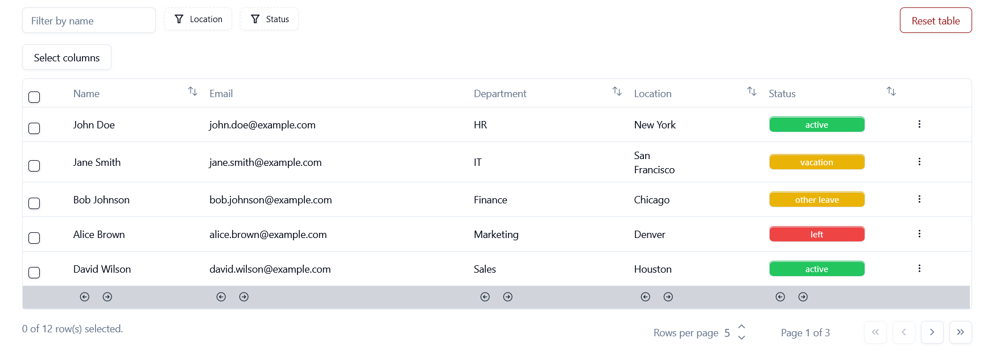
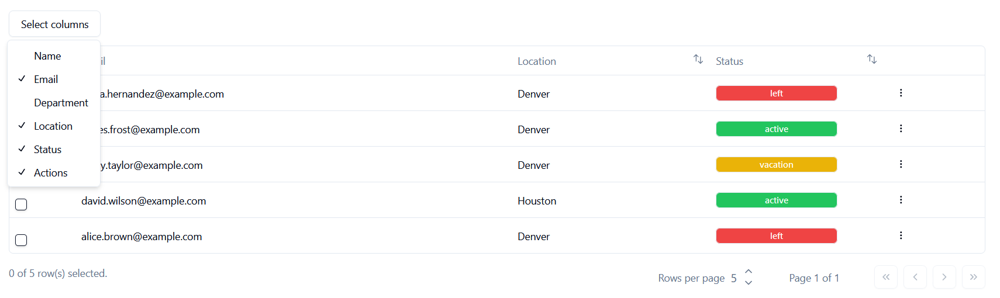

# Data Table 

This is a data table built with **Shadcn** UI components and **Tanstack Table**.

- [Tanstack-table](https://tanstack.com/table/v8)
- [Shadcn-ui](https://ui.shadcn.com/docs) 

The table has been built following the excellent tutorial and examples found on Shadcn documentation, and extended.



## Configuration 🛠️

The project is built on **React-Vite** and uses **TypeScript**.

- Install React Vite and follow instructions create the project:
```
$ npm create vite@latest
```

- Install Shadcn and Tailwind: [Follow link for instructions](https://ui.shadcn.com/docs/installation/vite)

- Each Shadcn component is then installed separately:
```
$ npx shadcn-ui@latest add dropdown-menu
$ npx shadcn-ui@latest add button
```
## Data 📜

The table shows a fictional list of employees.

Data is simply fake data in an array in the project itself, rather than fetched from a real database.

## Features 💡

These are features of the table:

### TOOLBAR:

- **Search field:** Dynamic search by name.
- **Faceted filters:** Filtering by column values (**location**, **status**); values are dynamically listed based on column values.
   - **Filter tags** to show active filters and **clear filters** - button.
- **Column visibility:** A button to choose which columns are visible.
- **Reset:** Clears all filters and selections.
 
### TABLE:

- **Sorting:** Selected columns can be sorted ascending or descending.
- **Row select:** First column's checkbox selects the row.
- **Extra actions dropdown:** Each row displays extra actions at the end of the row. Only the first one is currently functional, and it copies the employee ID to clipboard and displays a toast-message.
- **Column reorder:** The last row features arrows that move columns right or left.

### FOOTER:

- **Info on selected rows**: Shows how many rows have been selected.
- **Dynamic rows per page button**: The use can increase or decrease rows per page by steps of 5.
- **Pagination buttons**: To go forward, backward, to last or first page.


Column visibility:

***
Faceted-filter dropdown:  

***
Filter tags and clear button:  

***
More actions:  

***  
Footer:  


## Structure 🧬

The Table is made up of 3 main parts: 

1. Page component that fetches data and renders Table component.
2. Table component.
3. Columns variable which contains the structure and styling of individual column content. 

Reusable components:

1. Pagination is its on component and can be reused for other tables.
2. The faceted filters require lengthy code and it is separated into its own component. It can be reused for other tables.
3. Little pop-up toast is its own reusable component.

## Next steps 🪜

➡️ Abstract the table component into a reusable one, and split it into smaller components.

➡️ Introduce context to avoid passing table data as prop -> Easier to handle data manipulation methods as they may happen in different components. 

## Tech

- React-Vite
- Shadcn UI
- Tanstack-table
- React icons
- Tailwind
- Typescript


